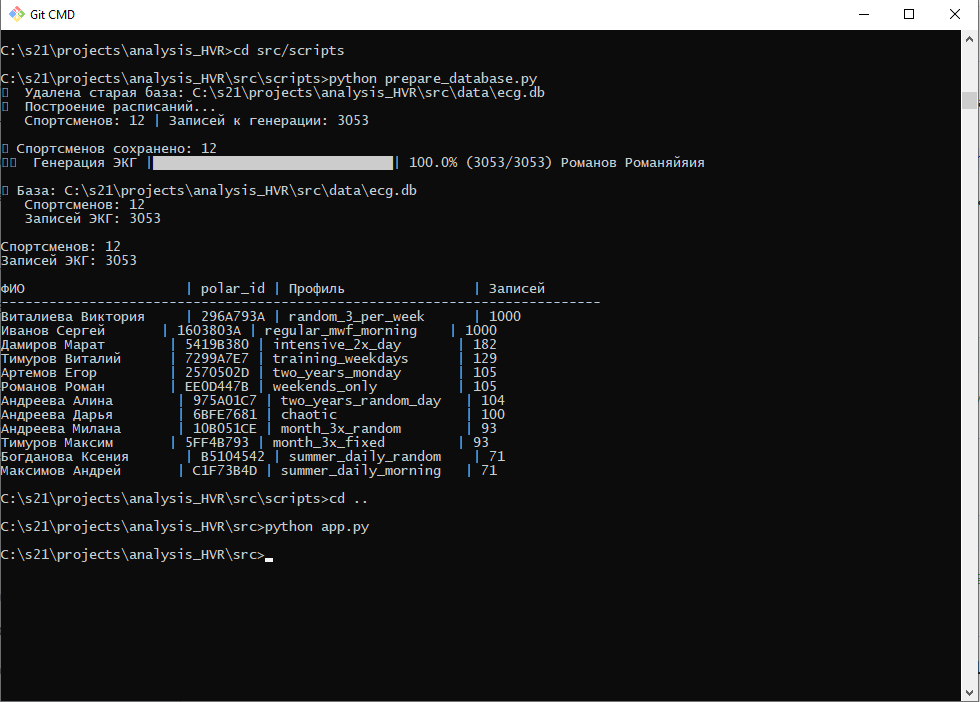
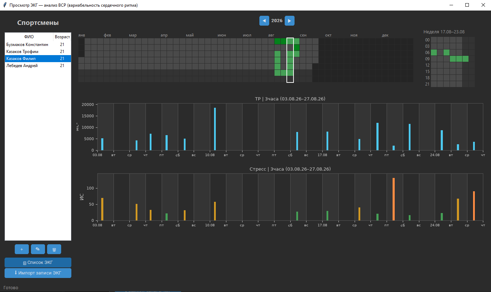
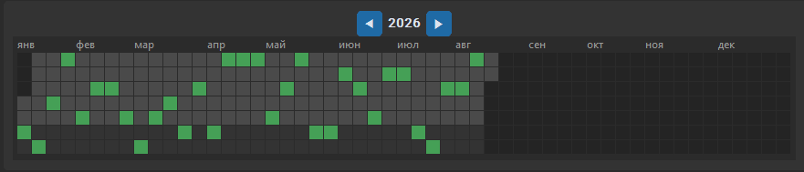
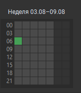
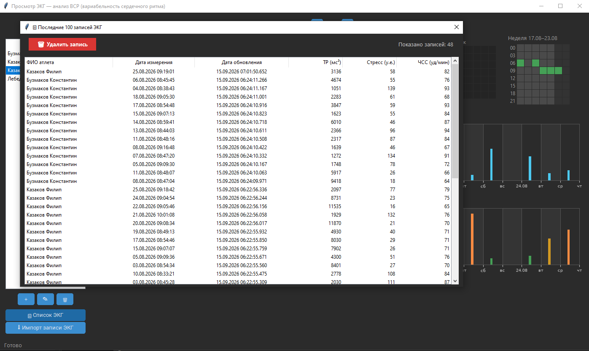
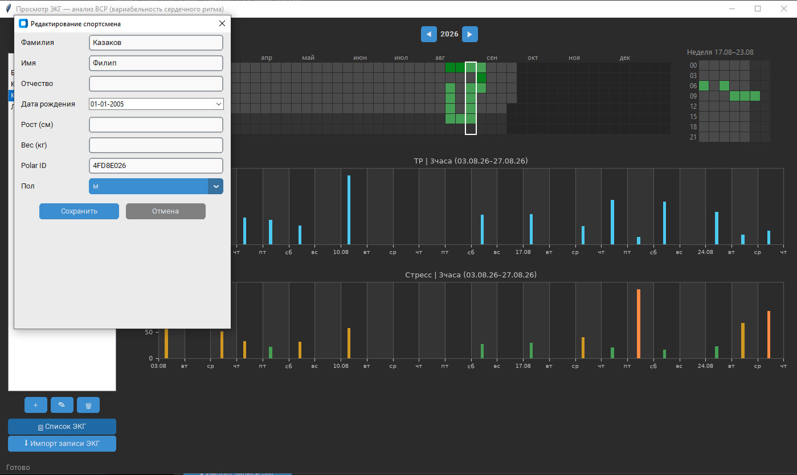
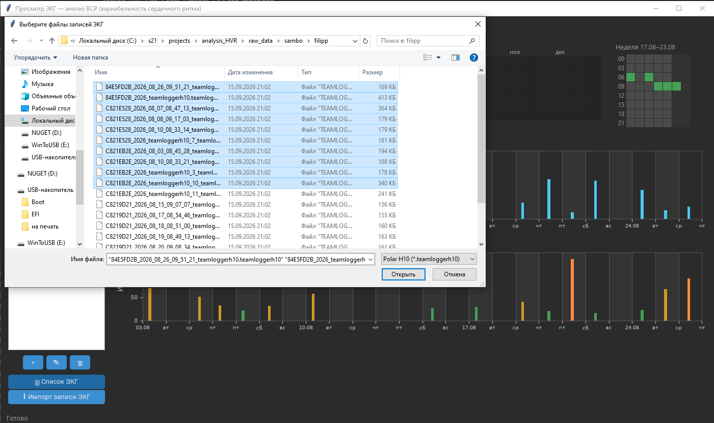

# analysis_HVR
## Стартап: датчики контроля состояния спортсмена

Приложение для анализа вариабельности сердечного ритма (ВРС/HRV): расчёт метрик
SDNN, RMSSD, индекса стресса, тепловые карты и графики.

---

## Содержание

1. [Зависимости](#зависимости)
2. [Установка](#установка)
3. [Быстрый старт](#быстрый-старт)
4. [Скриншоты](#скриншоты)
5. [Жесты управления](#жесты-управления)
6. [Структура проекта](#структура-проекта)
7. [Структура базы данных](#структура-базы-данных)
8. [Настройка тестового профиля атлета](#настройка-тестового-профиля-атлета)
9. [Настройка профиля ЭКГ](#настройка-профиля-экг)
10. [Ручной чек-лист (GUI)](#ручной-чек-лист-gui)
11. [Автотесты](#автотесты)
12. [Сборка EXE](#сборка-exe)
13. [Клонирование профиля из реальной записи](#клонирование-профиля-из-реальной-записи)

---

## Зависимости

Для запуска нужны **6 внешних библиотек**. Остальное (`os`, `sys`, `sqlite3`,
`datetime`, `uuid`, `random`, `math`) входит в стандартную библиотеку Python.

### Основные

| Библиотека | Назначение |
| --- | --- |
| `customtkinter` | GUI приложения (`app.py`, `dialogs.py`) |
| `matplotlib` | Графики TP и стресса |
| `tkcalendar` | Виджет календаря для ввода даты рождения |
| `sqlalchemy` | ORM для работы с БД (`models.py`) |
| `pyyaml` | Чтение `config.yaml` и `ecg_profiles.yaml` |
| `numpy` | Анализ сигнала ЭКГ и RR-интервалов |

### Для разработки (опционально)

Конечному пользователю не нужны, используются только при разработке:

| Библиотека | Назначение | Установка |
| --- | --- | --- |
| `pytest` | Автотесты | `pip install pytest` |
| `pyinstaller` | Сборка в `AnalysisHVR.exe` | `pip install pyinstaller` |
| `pillow` | Прозрачный фон логотипа в заставке (необязательно) | `pip install pillow` |

---

## Установка

Одной командой:

```bash
pip install customtkinter matplotlib tkcalendar sqlalchemy pyyaml numpy
```

Или через `requirements.txt` (создайте файл в корне проекта):

```txt
customtkinter>=5.2.0
matplotlib>=3.7.0
tkcalendar>=1.6.1
sqlalchemy>=2.0.0
pyyaml>=6.0
numpy>=1.24.0
```

```bash
pip install -r requirements.txt
```

### Проверка установки

```bash
python -c "import customtkinter, matplotlib, tkcalendar, sqlalchemy, yaml, numpy; print('Все библиотеки установлены')"
```

---

## Быстрый старт

Если всё установлено — запускайте:

```bash
cd src/scripts
python prepare_database.py              # config.yaml
# или со своим конфигом:
python prepare_database.py --config другой_конфиг.yaml
cd ..
python app.py
```

---

## Скриншоты


*Рисунок 1. Командная строка. Подготовка тестовых данных с помощью скрипта.*


*Рисунок 2. Главное окно приложения анализа ВРС.*

### Годовой heatmap

<p align="center">
  
</p>

Кликайте по квадратам, чтобы выбрать неделю:

<p align="center">
  
</p>

…и просмотреть ЭКГ-записи.


*Рисунок 3. Список записей в трёхчасовой ячейке.*


*Рисунок 4. Окно редактирования / добавления атлета.*


*Рисунок 5. Импорт файла записи с датчика.*

---

## Жесты управления

### Графики ТР и стресса

| Жест | Действие |
| --- | --- |
| Колесо мыши | Зум к положению курсора (увеличить/уменьшить) |
| Зажать и тянуть | Панорамирование по времени |
| Одинарный клик | Курсор на yearmap — на неделю кликнутой даты |
| ПКМ | Сброс на весь период выбранного атлета (оркестратор очищает и перезагружает оба графика + heatmap) |

### Годовой heatmap (yearmap)

| Жест | Действие |
| --- | --- |
| Одинарный клик | Курсор на неделю + центрирование графика по четвергу недели |
| Двойной клик | Диапазон графика = месяц ±15 дней от середины выбранной недели |
| Колесо мыши | Переключение года (вперёд/назад) |
| ПКМ | Диапазон графика = весь год (с 1 января по 31 декабря) |

### Недельный heatmap (weekmap)

| Жест | Действие |
| --- | --- |
| Одинарный клик по заполненной ячейке | Открыть список ЭКГ за 3-часовой блок |
| Одинарный клик по пустой ячейке | Ничего не происходит |
| Двойной клик по любой ячейке | Диапазон графика = кликнутые сутки (от 00:00 до 24:00) |
| ПКМ | Диапазон графика = вся отображаемая неделя + курсор yearmap синхронизируется |

### Смена атлета и сохранение состояния

- При смене атлета видимый диапазон (окно зума) сохраняется.
- При закрытии приложения сохраняются: последний атлет, год, курсор недели
  на yearmap и масштаб графиков. При старте — восстанавливаются.
- Если БД подменили и сохранённого атлета нет — выбирается первый из списка.

---

## Структура проекта

```txt
analysis_HVR\src\
|   analysis.py                    Парсинг RR-интервалов, расчёт ВРС-метрик (SDNN, RMSSD) и индекса стресса
|   app.py                         Главное окно приложения: оркестратор, сплэш, восстановление состояния
|   appsettings.py                 Сохранение/восстановление состояния (атлет, год, неделя, зум) в JSON
|   atlets.py                      Панель списка спортсменов: отображение, CRUD, импорт записей
|   build.bat                      Скрипт сборки AnalysisHVR.exe через PyInstaller с прогоном тестов
|   charts.py                      Контейнер графиков TP/Стресс, синхронизация масштаба
|   dialogs.py                     Диалоги AthleteDialog (создание/редактирование) и ECGListDialog (список ЭКГ)
|   ghost.py                       ResizeController — адаптивный ресайз виджетов
|   heatmap.py                     Составной виджет: годовой heatmap + недельный + переключатель года
|   importer.py                    Импорт записей Polar H10 в БД (привязка по polar_id)
|   logo21.png                     Логотип 512×512 для заставки при запуске приложения
|   metricplot.py                  Отрисовка одного графика ВРС: зум, панорама, клики, ПКМ
|   orchestrator.py                Централизованный менеджер состояния: координация виджетов
|   splash.py                      SplashScreen — полноэкранная заставка с прогрессом загрузки модулей
|   theme.py                       Цветовая палитра и константы стилей для единого оформления GUI
|   timeframe.py                   Таймфреймы баров (HOUR3, DAY, WEEK), подбор по span, зебра, границы лет
|   weekmap.py                     Недельный heatmap: 7 дней × 8 трёхчасовых блоков
|   yearmap.py                     Годовой heatmap: 53 недели × 7 дней, подписи месяцев, курсор
|
+---data
|       ecg.db                     SQLite-база данных: таблицы athletes, ecg_records и ecg_raw
|
+---docs
|   |   QUICKSTART.md              Руководство по быстрому старту: установка, генерация БД, запуск
|   |
|   \---images
|           app_import.png         Скриншот диалога импорта записи ЭКГ из файла
|           app_main.png           Скриншот главного окна приложения с тепловой картой года
|           athlet_edit.png        Скриншот формы редактирования карточки спортсмена
|           ecg_list.png           Скриншот списка записей ЭКГ за выбранный интервал
|           prepare_database.png   Скриншот вывода скрипта prepare_database.py
|           week_heatmap.png       Скриншот недельной тепловой карты (7 дней × 8 блоков)
|           year_heatmap.png       Скриншот годовой тепловой карты (53 недели × 7 дней)
|
+---scripts
|   |   athlete_generator.py       Генерация тестовых спортсменов: ФИО, антропометрия, оценки ВРС по возрасту
|   |   calibrate_ecg.py           Автокалибровка профилей ЭКГ по целевым метрикам качества (SNR, дрейф)
|   |   config.yaml                Настройки генерации БД: длительность, сид, список спортсменов, расписание
|   |   config_big.yaml            Альтернативный конфиг с увеличенными объёмами данных
|   |   database.py                Менеджер пути к БД с учётом режима запуска (exe/исходники/тесты)
|   |   db_info.py                 Диагностика БД: размер файла, количество записей, средние метрики ВРС
|   |   db_schema.py               Вывод полной схемы БД: таблицы, колонки, индексы, внешние ключи
|   |   ecg_generator.py           Генерация синтетических ЭКГ в формате TeamLoggerH10 по профилю
|   |   ecg_profiles.yaml          Профили формы сигнала ЭКГ: default, high_quality, fast, real_c8208e2e
|   |   fit_profile_from_real.py   Извлечение профиля ЭКГ из реальной записи Polar H10
|   |   migrate_split_raw.py       Миграция: вынос raw_data из ecg_records в отдельную таблицу ecg_raw
|   |   models.py                  ORM-модели SQLAlchemy: Athlete, ECGRecord, ECGRaw и get_session
|   |   prepare_database.py        Главный скрипт: очистка БД, генерация спортсменов, построение расписания, генерация ЭКГ с прогресс-баром. Поддерживает --config
|   |   schedule_engine.py         Построение расписаний записей ЭКГ для каждого спортсмена
|   |
\---tests
        etalons.json               Эталонные метрики (RMSSD, ИС, TP) из Омега.Диагностика для сверки
        test_metricplot.py         Клик, двойной клик, ПКМ, панорамирование на графиках
        test_orchestrator.py       Сохранение/восстановление масштаба, смена атлета, полный цикл save/restore
        test_reference_ecg.py      Импорт эталонной ЭКГ в базу и сверка метрик с etalons.json
        test_timeframe.py          Подбор таймфрейма, зебра, границы лет
        test_weekmap.py            Клик/двойной/ПКМ по weekmap (зелёная/пустая ячейка)
        test_yearmap.py            Клик/двойной/ПКМ/колесо по yearmap
        reference\                 Эталонные файлы .teamloggerh10 для test_reference_ecg.py
```

---

## Структура базы данных

```txt
┌─ athletes
│
│  Колонки:
│    id                        VARCHAR          [PK, NOT NULL]
│    last_name                 VARCHAR          [NOT NULL]
│    first_name                VARCHAR          [NOT NULL]
│    middle_name               VARCHAR
│    gender                    VARCHAR
│    birth_date                VARCHAR
│    height_cm                 INTEGER
│    weight_kg                 FLOAT
│    resting_hr                INTEGER
│    max_hr                    INTEGER
│    hrv_rmssd_baseline        INTEGER
│    avg_rr_ms                 INTEGER
│    polar_id                  VARCHAR
│
│  Индексы:
│    UNIQUE sqlite_autoindex_athletes_2              (polar_id)
│    UNIQUE sqlite_autoindex_athletes_1              (id)
└──────────────────────────────────────────────────────────────────────

┌─ ecg_records
│
│  Колонки:
│    id                        INTEGER          [PK, NOT NULL]
│    athlete_id                VARCHAR          [NOT NULL]
│    recorded_at               VARCHAR          [NOT NULL]
│    duration_seconds          FLOAT
│    profile                   VARCHAR
│    mean_hr                   FLOAT
│    rmssd                     FLOAT
│    sdnn                      FLOAT
│    status                    VARCHAR
│    stress_si                 FLOAT
│
│  Foreign Keys:
│    athlete_id → athletes.id  ON DELETE CASCADE
│
│  Индексы:
│    ix_ecg_records_recorded_at               (recorded_at)
│    ix_ecg_records_athlete_id                (athlete_id)
└──────────────────────────────────────────────────────────────────────

┌─ ecg_raw
│
│  Колонки:
│    record_id                 INTEGER          [PK, NOT NULL]
│    raw_data                  TEXT             [NOT NULL]
│
│  Foreign Keys:
│    record_id → ecg_records.id  ON DELETE CASCADE
└──────────────────────────────────────────────────────────────────────
```

### Связи (ER-диаграмма)

```txt
ecg_records.athlete_id  ──→  athletes.id
ecg_raw.record_id       ──→  ecg_records.id
```

---

## Настройка тестового профиля атлета

```txt
профиль спортсмена (rmssd, RR) → генератор ECG/RR → БД → графики
        ↑                                                    ↓
   физиологичные оценки  ←──────────────────────────  метрики TP/ИС
```

Файл `src/scripts/config.yaml` управляет генерацией тестовых данных: составом
команды, параметрами спортсменов и расписанием записей.

```yaml
# ============================================================
# ГЛОБАЛЬНЫЕ НАСТРОЙКИ
# ============================================================
settings:
  duration_seconds: 12.0        # Длительность каждой записи ЭКГ (сек)
  db_path: null                 # Путь к БД (null = дефолт ../data/ecg.db)
  store_raw_data: true          # Сохранять raw ECG в БД (true/false)
  seed: 42                      # Seed для воспроизводимости (null = случайность)

# ============================================================
# СПИСОК СПОРТСМЕНОВ
# ============================================================
team:
  - { birth_year: 2008, gender: M, profile: regular_mwf_morning }
  - { birth_year: 2010, gender: F, profile: daily_evening }
  - { birth_year: 2005, gender: M, profile: regular_mwf_morning }
  # ... добавьте сколько нужно

# ============================================================
# ПРОФИЛИ РАСПИСАНИЙ
# ============================================================
profiles:
  regular_mwf_morning:
    days: [0, 2, 4]             # Пн=0, Вт=1, Ср=2, Чт=3, Пт=4, Сб=5, Вс=6
    hour: 9
    minute: 0

  daily_evening:
    days: [0, 1, 2, 3, 4, 5, 6] # Каждый день
    hour: 18
    minute: 30

  weekend_only:
    days: [5, 6]                # Только выходные
    hour: 10
    minute: 0
```

### Параметры спортсмена

| Параметр | Тип | Описание | Влияние на графики |
| --- | --- | --- | --- |
| `birth_year` | int | Год рождения (2005–2015) | Возраст → RMSSD: молодые (12–15 лет) имеют RMSSD 60–90, старшие (18+) — 40–60 |
| `gender` | str | Пол: M или F | Влияет на рост/вес/пульс покоя (женщины +5 уд/мин) |
| `profile` | str | Название профиля из секции `profiles` | Определяет расписание записей |

### Параметры профиля расписания

| Параметр | Тип | Описание |
| --- | --- | --- |
| `days` | list[int] | Дни недели: 0 = Пн, 1 = Вт, …, 6 = Вс |
| `hour` | int | Час записи (0–23) |
| `minute` | int | Минута записи (0–59) |

### Как возраст влияет на метрики

```txt
Возраст    →  _estimate_hrv_rmssd(age)  →  TP ≈ SDNN²  →  ИС
────────────────────────────────────────────────────────────────
12–14      →  70–90 мс                   →  5000–8000   →  25–40 🟢
15–17      →  60–80 мс                   →  3600–6400   →  35–50 🟢
18–22      →  50–70 мс                   →  2500–4900   →  45–65 🟡
23+        →  40–60 мс                   →  1600–3600   →  60–85 🟡
```

---

## Типичные сценарии

### 1. Команда подростков (12–15 лет)

```yaml
settings:
  duration_seconds: 12.0
  seed: 42

team:
  - { birth_year: 2012, gender: M, profile: regular_mwf_morning }
  - { birth_year: 2011, gender: F, profile: regular_mwf_morning }
  - { birth_year: 2013, gender: M, profile: regular_mwf_morning }
  - { birth_year: 2010, gender: F, profile: regular_mwf_morning }
  - { birth_year: 2012, gender: M, profile: regular_mwf_morning }

profiles:
  regular_mwf_morning:
    days: [0, 2, 4]
    hour: 9
    minute: 0
```

Ожидаемые графики: TP 5000–8000, ИС 25–45 (зелёно-жёлтая зона).

### 2. Взрослые спортсмены (18–25 лет)

```yaml
settings:
  duration_seconds: 12.0
  seed: 42

team:
  - { birth_year: 2005, gender: M, profile: daily_evening }
  - { birth_year: 2003, gender: F, profile: daily_evening }
  - { birth_year: 2006, gender: M, profile: daily_evening }
  - { birth_year: 2004, gender: F, profile: daily_evening }

profiles:
  daily_evening:
    days: [0, 1, 2, 3, 4, 5, 6]
    hour: 19
    minute: 0
```

Ожидаемые графики: TP 2500–5000, ИС 45–70 (жёлто-оранжевая зона).

### 3. Смешанная команда с разными профилями

```yaml
settings:
  duration_seconds: 12.0
  seed: 42

team:
  # Молодые (утренние тренировки)
  - { birth_year: 2012, gender: M, profile: morning_training }
  - { birth_year: 2011, gender: F, profile: morning_training }

  # Старшие (вечерние тренировки)
  - { birth_year: 2005, gender: M, profile: evening_training }
  - { birth_year: 2003, gender: F, profile: evening_training }

  # Тренер (только выходные)
  - { birth_year: 1990, gender: M, profile: weekend_only }

profiles:
  morning_training:
    days: [0, 2, 4]
    hour: 8
    minute: 0

  evening_training:
    days: [1, 3, 5]
    hour: 18
    minute: 30

  weekend_only:
    days: [5, 6]
    hour: 10
    minute: 0
```

### Параметр `seed`

```yaml
seed: 42          # Воспроизводимая генерация
seed: null        # Случайная генерация (каждый запуск разные данные)
```

- `seed: 42` — при каждом `python prepare_database.py` генерируются одинаковые данные (полезно для отладки);
- `seed: null` — каждый раз случайные данные (полезно для разнообразия).

### Параметр `store_raw_data`

```yaml
store_raw_data: true   # Сохранять raw ECG (10–50 КБ на запись)
store_raw_data: false  # Не сохранять (экономия места, но нельзя экспортировать)
```

| Значение | Размер БД (3000 записей) | Экспорт ЭКГ |
| --- | --- | --- |
| `true` | ~150–200 МБ | ✅ доступен |
| `false` | ~5–10 МБ | ❌ недоступен |

### Параметр `duration_seconds`

```yaml
duration_seconds: 12.0    # Быстрая генерация, короткие записи
duration_seconds: 300.0   # Реалистичная длительность (5 мин), медленная генерация
```

- 12 сек — достаточно для расчёта RMSSD/SDNN, быстрая генерация;
- 300 сек (5 мин) — стандарт для HRV-анализа, генерация 3000 записей займёт 5–10 минут.

### Полный пример: команда с разнообразием

```yaml
settings:
  duration_seconds: 12.0
  db_path: null
  store_raw_data: true
  seed: 42

team:
  # Подростки (12–14 лет) — высокая вариабельность
  - { birth_year: 2012, gender: M, profile: regular_mwf_morning }
  - { birth_year: 2011, gender: F, profile: regular_mwf_morning }
  - { birth_year: 2013, gender: M, profile: regular_mwf_morning }

  # Юниоры (15–17 лет) — средняя вариабельность
  - { birth_year: 2009, gender: M, profile: daily_evening }
  - { birth_year: 2008, gender: F, profile: daily_evening }

  # Взрослые (18–22 года) — умеренная вариабельность
  - { birth_year: 2005, gender: M, profile: regular_mwf_morning }
  - { birth_year: 2004, gender: F, profile: daily_evening }

profiles:
  regular_mwf_morning:
    days: [0, 2, 4]
    hour: 9
    minute: 0

  daily_evening:
    days: [0, 1, 2, 3, 4, 5, 6]
    hour: 18
    minute: 30
```

После сохранения запустите:

```bash
cd src/scripts
python prepare_database.py              # config.yaml
python prepare_database.py --config другой_конфиг.yaml
```

---

## Настройка профиля ЭКГ

Файл `src/scripts/ecg_profiles.yaml` управляет качеством генерируемых
ЭКГ-сигналов. Разные профили подходят для разных задач: отладка, точный анализ
или быстрая генерация.

### Структура файла

```yaml
active_profile: default          # ← какой профиль используется сейчас

profiles:
  default:                       # название профиля
    description: ...             # описание
    transient_duration: 146      # переходный процесс
    baseline_mean: -200          # базовая линия
    baseline_noise_range: [-8, 8]# шум
    # ... параметры волн P, Q, R, S, T
    target:                      # целевые метрики качества
      min_snr: 15.0
      max_artifact_pct: 2.0
      max_baseline_drift: 50.0
```

### Переходный процесс (transient)

| Параметр | Описание | Влияние |
| --- | --- | --- |
| `transient_duration` | Длительность переходного процесса (отсчёты) | Сколько отсчётов в начале файла «настраивается» датчик |
| `transient_start_value` | Начальное значение | Чем больше, тем сильнее «всплеск» в начале |
| `transient_end_value` | Конечное значение | Куда приходит сигнал после переходного процесса |

Рекомендация: 100–150 отсчётов достаточно. Меньше = быстрее стабилизация.

### Базовая линия и шум

| Параметр | Описание | Влияние на качество |
| --- | --- | --- |
| `baseline_mean` | Среднее значение базовой линии | Сдвиг всего сигнала вверх/вниз |
| `baseline_respiratory_amplitude` | Амплитуда дыхательного дрейфа | Больше = сильнее «качание» базовой линии |
| `baseline_respiratory_frequency` | Частота дыхания (0.04–0.06 Гц) | Определяет скорость колебаний |
| `baseline_noise_range` | Диапазон шума [min, max] | Больше = ниже SNR, но реалистичнее |

Пример:

```yaml
baseline_noise_range:
  - -8
  - 8
```

Шум от -8 до +8 мкВ. `[0, 0]` = идеально чистый сигнал.

Расчёт длительности кардиоцикла:

```txt
heart_rate_period = 130 * RR_мс / 1000

Пример: RR 900 мс → 130 * 900 / 1000 = 117 отсчётов
```

Рекомендация: 110–120 для покоя (65–75 уд/мин).

### Волны P, Q, R, S, T

Каждая волна описывается тремя параметрами:

```yaml
r_wave:
  start: 14        # начало (отсчёт от начала комплекса)
  end: 19          # конец
  amplitude: 1300  # амплитуда (мкВ)
```

| Волна | Типичная амплитуда | Назначение |
| --- | --- | --- |
| P | 100–200 | Деполяризация предсердий |
| Q | -100 … -200 | Начало деполяризации желудочков |
| R | 800–1500 | Основной пик (используется для детекции) |
| S | -1000 … -1500 | Завершение деполяризации |
| T | 300–500 | Реполяризация желудочков |

Важно: R-пик должен быть самым высоким — детектор R-пиков ищет максимум.

### Целевые метрики качества (target)

```yaml
target:
  min_snr: 15.0              # минимальный SNR (дБ)
  max_artifact_pct: 2.0      # максимум артефактов (%)
  max_baseline_drift: 50.0   # максимум дрейфа базовой линии
```

| Метрика | Что измеряет | Хорошее значение |
| --- | --- | --- |
| `min_snr` | Отношение сигнал/шум | ≥ 15 дБ |
| `max_artifact_pct` | Процент артефактных R-пиков | ≤ 2 % |
| `max_baseline_drift` | Амплитуда дрейфа базовой линии | ≤ 50 |

### Сравнение трёх профилей

| Параметр | default | high_quality | fast | Назначение |
| --- | --- | --- | --- | --- |
| `transient_duration` | 146 | 100 | 80 | Баланс качества и скорости |
| `baseline_noise_range` | [-8, 8] | [0, 0] | [-20, 20] | Точный анализ ВРС |
| `baseline_respiratory_amplitude` | 92 | 41 | 60 | Быстрая отладка |
| R-амплитуда | 1300 | 9283 | 1200 | — |
| `min_snr` | 15.0 | 20.0 | 12.0 | — |
| `max_artifact_pct` | 2.0 | 1.0 | 3.0 | — |
| Время генерации | 1× | 1× | ~0.8× | — |
| Качество | ⭐⭐⭐⭐ | ⭐⭐⭐⭐⭐ | ⭐⭐⭐ | — |

### Когда какой профиль использовать

**`default` — универсальный выбор**

```yaml
active_profile: default
```

```txt
Применение:
- Разработка и тестирование GUI
- Демонстрация приложения
- Генерация тестовой базы для отчётов

Характеристики:
- SNR ~15 дБ — реалистичный шум
- Артефакты ~0.2% — почти идеально
- Дрейф ~42 — в пределах нормы
```

**`high_quality` — точный анализ**

```yaml
active_profile: high_quality
```

```txt
Применение:
- Научные исследования
- Валидация алгоритмов анализа
- Эталонные данные для сравнения

Особенности:
- baseline_noise_range: [0, 0] — нет шума вообще
- R-амплитуда 9283 — очень чёткие пики
- Дрейф 30 — минимальный

Предупреждение: нереалистично «чистый» сигнал, не подходит для имитации
реальных условий.
```

**`fast` — быстрая генерация**

```yaml
active_profile: fast
```

```txt
Применение:
- Отладка пайплайна обработки
- Быстрая проверка импорта/экспорта
- CI/CD тесты

Особенности:
- Шум [-20, 20] — больше шума, ниже SNR
- Быстрее на ~20% за счёт короткого transient
- Допускает больше артефактов (3%)
```

### Переключение профилей

1. Измените `active_profile` в `ecg_profiles.yaml`:
   ```yaml
   active_profile: high_quality    # или default, или fast
   ```
2. Перегенерируйте базу:
   ```bash
   cd src/scripts
   python prepare_database.py
   ```
3. Проверьте качество:
   ```bash
   python ecg_generator.py
   ```
   Выведет SNR, артефакты, дрейф и итоговый score в процентах.

### Создание своего профиля

Пример «Реалистичный с артефактами». Добавьте в `ecg_profiles.yaml`:

```yaml
profiles:
  realistic:
    description: Реалистичный сигнал с умеренным шумом
    transient_duration: 120
    transient_start_value: 10000
    transient_end_value: -150
    baseline_mean: -200
    baseline_respiratory_amplitude: 100
    baseline_respiratory_frequency: 0.05
    baseline_noise_range:
      - -15
      - 15
    heart_rate_period: 115
    p_wave:
      start: 0
      end: 8
      amplitude: 150
    q_wave:
      start: 10
      end: 14
      amplitude: -150
    r_wave:
      start: 14
      end: 19
      amplitude: 1300
    s_wave:
      start: 19
      end: 25
      amplitude: -1400
    t_wave:
      start: 35
      end: 55
      amplitude: 350
    target:
      min_snr: 12.0
      max_artifact_pct: 5.0
      max_baseline_drift: 70.0
```

Активируйте:

```yaml
active_profile: realistic
```

### Калибровка профиля

Если метрики не соответствуют целевым, запустите автокалибровку:

```bash
cd src/scripts

# Калибровка одного профиля
python calibrate_ecg.py --profile default

# Калибровка всех профилей
python calibrate_ecg.py --all
```

Скрипт подберёт оптимальные параметры и перезапишет `ecg_profiles.yaml`.

### Советы по настройке

| Задача | Решение |
| --- | --- |
| Слишком много шума | Уменьшите `baseline_noise_range`: `[-5, 5]` вместо `[-15, 15]` |
| R-пики не детектируются | Увеличьте `r_wave.amplitude` до 1500+ |
| Дрейф базовой линии | Уменьшите `baseline_respiratory_amplitude` до 40–60 |
| Нужна быстрая генерация | Используйте профиль `fast` или уменьшите `transient_duration` |
| Нужен идеальный сигнал | Используйте `high_quality` с `baseline_noise_range: [0, 0]` |
| Реалистичные условия | Добавьте шум `[-10, 10]` и дрейф 80–100 |

### Типовые ошибки

| Ошибка | Причина | Решение |
| --- | --- | --- |
| SNR < 10 дБ | Слишком большой шум или маленькая R-амплитуда | Увеличьте `r_wave.amplitude` или уменьшите шум |
| Артефакты > 5% | R-пики плохо выделяются | Увеличьте R-амплитуду относительно шума |
| Дрейф > 80 | Слишком сильное дыхание | Уменьшите `baseline_respiratory_amplitude` |
| Детектор пропускает R-пики | R-амплитуда меньше шума | Увеличьте R до 1500+, шум до `[-10, 10]` |

### Полный шаблон профиля

```yaml
my_profile:
  description: Описание назначения профиля
  transient_duration: 120
  transient_start_value: 10000
  transient_end_value: -150
  baseline_mean: -200
  baseline_respiratory_amplitude: 80
  baseline_respiratory_frequency: 0.05
  baseline_noise_range:
    - -10
    - 10
  heart_rate_period: 115
  p_wave:
    start: 0
    end: 8
    amplitude: 150
  q_wave:
    start: 10
    end: 14
    amplitude: -150
  r_wave:
    start: 14
    end: 19
    amplitude: 1300
  s_wave:
    start: 19
    end: 25
    amplitude: -1400
  t_wave:
    start: 35
    end: 55
    amplitude: 350
  target:
    min_snr: 15.0
    max_artifact_pct: 2.0
    max_baseline_drift: 50.0
```

Теперь вы можете гибко настраивать качество генерируемых ЭКГ под любую задачу —
от быстрой отладки до научных исследований.

---

## Ручной чек-лист (GUI)

Прогоните после крупных правок — 2 минуты.

| № | Действие | Ожидаемый результат |
|---|----------|---------------------|
| 1 | `python app.py` | Заставка → окно без пауз и ошибок в консоли |
| 2 | Выбрать спортсмена | Отображаются детали, heatmap и графики |
| 3 | ◀ / ▶ год | Год переключается в диапазоне доступных данных |
| 4 | Клик по году на heatmap | Появляется рамка недели + отображаются недельные графики |
| 5 | Клик по оранжевому столбику ИС | Выделяется та же неделя (проверка `align='edge'`) |
| 6 | Клик по зелёному квадрату недели | Открывается окно со списком ЭКГ за 3 часа |
| 7 | Клик по серому квадрату | Ничего не происходит |
| 8 | Экспорт записи | Файл `.teamloggerh10` сохраняется |
| 9 | Удалить запись | Heatmap и графики обновляются |
| 10 | ＋ спортсмен | Открывается календарь (формат ДД-ММ-ГГГГ), данные сохраняются |
| 11 | ✎ / 🗑 спортсмена | Выполняется редактирование / каскадное удаление |
| 12 | Импорт файла | Происходит привязка по `polar_id`, дубликаты блокируются |
| 13 | Закрыть окно | Процесс завершается, нет «висячего» `python.exe` |

---

## Автотесты

### Структура

```text
src/
└── tests/
    ├── etalons.json               # эталонные метрики Омега.Диагностика
    ├── test_metricplot.py         # клик, двойной клик, ПКМ, панорамирование на графиках
    ├── test_orchestrator.py       # сохранение/восстановление масштаба, смена атлета
    ├── test_reference_ecg.py      # сверка с эталонной записью Polar H10
    ├── test_timeframe.py          # подбор таймфрейма, зебра, границы лет
    ├── test_weekmap.py            # клик/двойной/ПКМ по weekmap (зелёная/пустая ячейка)
    ├── test_yearmap.py            # клик/двойной/ПКМ/колесо по yearmap
    └── reference/                 # эталонные файлы .teamloggerh10
```

### Установка

```bash
pip install pytest
```

### Запуск

```bash
cd C:\s21\projects\analysis_HVR\src

python -m pytest tests -v                        # все тесты (6 файлов)
python -m pytest tests/test_metricplot.py -v     # жесты на графиках
python -m pytest tests/test_weekmap.py -v        # жесты weekmap
python -m pytest tests/test_yearmap.py -v        # жесты yearmap
python -m pytest tests/test_orchestrator.py -v   # масштаб и смена атлета
python -m pytest tests/test_reference_ecg.py -v  # сверка с эталонами Омега.Диагностика
```

### Тесты сверки с эталонами (`test_reference_ecg.py`)

Импортирует эталонную запись Polar H10 из `tests/reference/` в базу через `importer._import_one`
(тем же путём, что и приложение) и сверяет рассчитанные метрики (RMSSD, индекс стресса, TP) с
ожидаемыми значениями из `tests/etalons.json` (источник — «Омега.Диагностика»).

| Файл | Назначение |
| --- | --- |
| `tests/etalons.json` | Ожидаемые метрики и допуски для каждой эталонной записи |
| `tests/reference/` | Эталонные файлы `.teamloggerh10` для импорта |

Чтобы добавить новый эталон: положите файл в `tests/reference/` и допишите запись
в `tests/etalons.json` (поля `file`, `polar_id`, `expected` с допуском `tol`).

---

## Сборка EXE

Используем PyInstaller — он соберёт Python + все библиотеки + данные в один
исполняемый файл.

В exe-версии база данных должна лежать рядом с exe, а не внутри архива.

### Установка PyInstaller

```bash
pip install pyinstaller
```

### Запуск сборки

```bash
cd \analysis_HVR\src
build.bat
```

```txt
build.bat          ← тесты + сборка (полный цикл)
build.bat --fast   ← только сборка (если тесты уже прогоняли)
```

### Что означают флаги

| Флаг | Назначение |
| --- | --- |
| `--onedir` | Папка с exe + файлами (быстрый старт, проще отлаживать) |
| `--windowed` | Без чёрного окна консоли |
| `--add-data "logo21.png;."` | Логотип внутрь сборки |
| `--add-data "scripts\ecg_profiles.yaml;."` | Профили ЭКГ внутрь сборки |
| `--collect-all customtkinter` | Темы и шрифты customtkinter |
| `--hidden-import ...` | Модули, которые PyInstaller не нашёл сам |

### Результат

```txt
dist/
└── AnalysisHVR/
    ├── AnalysisHVR.exe      ← запуск
    ├── _internal/           ← библиотеки и данные
    └── data/
        └── ecg.db           ← база данных
```

### Раздача пользователям

```bash
cd dist
tar -a -cf AnalysisHVR.zip AnalysisHVR
```

---

## Клонирование профиля из реальной записи
### Краткая сводка
```
python fit_profile_from_real.py <ФАЙЛ> [--name ИМЯ] [--activate]
```
| Аргумент | Обязательный | По умолчанию | Назначение |
| --- | --- | --- | --- |
| `file` | ✅ | — | Путь к файлу записи Polar H10 (`.teamloggerh10` или `.txt`) |
| `--name` | ❌ | `real_sport` | Имя профиля в `ecg_profiles.yaml` |
| `--activate` | ❌ | выкл. | Сделать этот профиль активным (запишет `active_profile: ИМЯ`) |

### Примеры использования
#### 1. Базовый запуск — профиль с именем по умолчанию
```bash
python fit_profile_from_real.py "C8208E2E_2026-6.teamloggerh10"
```
**Результат:**
- В ecg_profiles.yaml появится профиль real_sport
- Активный профиль не меняется (остаётся тот, что был)

#### 2. Своё имя профиля
```bash
python fit_profile_from_real.py "C8208E2E_2026-6.teamloggerh10" --name ivanov_morning
```
**Результат:**
- В ecg_profiles.yaml появится профиль ivanov_morning
- Активный профиль не меняется

#### 3. Создать профиль и сразу сделать активным
```bash
python fit_profile_from_real.py "C8208E2E_2026-6.teamloggerh10" --name real_c8208e2e --activate
```
**Результат:**
- В ecg_profiles.yaml появится профиль real_c8208e2e
- active_profile: real_c8208e2e — следующий запуск ecg_generator.py будет использовать его

В файле `ecg_profiles.yaml` появится профиль:

```yaml
real_c8208e2e:
    transient_duration: 303
    transient_start_value: 13148
    transient_end_value: 24
    baseline_mean: -117
    baseline_respiratory_amplitude: 67
    baseline_respiratory_frequency: 0.0226
    baseline_noise_range:
    - -60
    - 60
    heart_rate_period: 136
    p_wave:
      start: 0
      end: 8
      amplitude: 60
    q_wave:
      start: 10
      end: 14
      amplitude: -50
    r_wave:
      start: 14
      end: 19
      amplitude: 1459
    s_wave:
      start: 19
      end: 25
      amplitude: -938
    t_wave:
      start: 35
      end: 55
      amplitude: 497
    target:
      min_snr: 15.0
      max_artifact_pct: 2.0
      max_baseline_drift: 50.0
    description: Спортивный профиль по реальной записи C8208E2E от 2026.05.05 06:52:21

active_profile: real_c8208e2e
```

#### 4. Файл с пробелами в пути
```bash
python fit_profile_from_real.py "C:\записи\моя запись.teamloggerh10" --name test --activate
```
⚠️ Путь с пробелами или кириллицей обязательно в кавычках.
#### 5. Файл из другой директории
```bash
cd C:\s21\projects\analysis_HVR\src\scripts
python fit_profile_from_real.py "..\..\data\recordings\morning_session.teamloggerh10" --name morning --activate
```
### Что делает скрипт по шагам
```
1. Читает файл записи Polar H10
   ├── [Header] → polar_id, datetime
   ├── [ECG]    → массив значений сигнала
   └── [RR]     → массив RR-интервалов

2. Извлекает параметры сигнала:
   ├── transient (переходный процесс): длительность, start/end значения
   ├── baseline (базовая линия): mean, дыхание, шум
   ├── heart_rate_period (период сердечного ритма)
   └── P/Q/R/S/T волны: амплитуды усреднённого комплекса

3. Считает ВРС-метрики из RR-интервалов:
   ├── Mean RR → средняя длина интервала
   ├── SDNN    → стандартное отклонение RR
   └── RMSSD   → среднеквадратичная разница соседних RR

4. Записывает профиль в scripts/ecg_profiles.yaml
   └── (опционально) обновляет active_profile

5. Выводит сводку параметров в консоль
```

### Ожидаемый вывод консоли (иллюстративный)

*Пример вывода — значения условные и могут отличаться от вашего файла записи.*

```
✅ Профиль 'real_c8208e2e' сохранён в ecg_profiles.yaml

=== Извлечённые параметры сигнала ===
  transient_duration                  = 303
  transient_start_value               = 13148
  transient_end_value                 = 24
  baseline_mean                       = -117
  baseline_respiratory_amplitude      = 67
  baseline_respiratory_frequency      = 0.0226
  baseline_noise_range                = [-30, 30]
  heart_rate_period                   = 136
  p_wave                              = 100
  q_wave                              = -120
  r_wave                              = 1459
  s_wave                              = -938
  t_wave                              = 497

=== ВРС спортсмена (для карточки в БД) ===
  Mean RR  = 1046 мс  (ЧСС ≈ 57 уд/мин)
  SDNN     = 150 мс
  RMSSD    = 130 мс  → hrv_rmssd_baseline
  ```

### Типичные ошибки

| Ошибка | Причина | Решение |
| --- | --- | --- |
| `FileNotFoundError` | Неверный путь к файлу | Укажите полный путь или проверьте рабочую директорию |
| `ValueError: can't extend empty axis 0…` | Файл не в формате Polar H10 — сигнал пустой | Проверьте наличие секций `[ECG]` и `[RR]` в файле |
| `RuntimeWarning: Mean of empty slice` → `ValueError: cannot convert float NaN to integer` | Слишком короткая запись — R-пики не найдены | Нужна запись длительностью ≥5 секунд |
| Профиль не появляется в GUI | Не перегенерирована БД | Запустите `python prepare_database.py` после создания профиля |

### Связь с другими скриптами
```bash
# 1. Создали профиль из реальной записи
python fit_profile_from_real.py "record.teamloggerh10" --name real --activate

# 2. Перегенерировали БД — все записи будут использовать этот профиль
python prepare_database.py

# 3. (Опционально) Докалибровали профиль под целевые метрики
python calibrate_ecg.py --profile real --iterations 5

# 4. Проверили результат
python ecg_generator.py
```
После шага 2 все спортсмены в БД будут иметь ЭКГ с формой сигнала, «снятой» с реальной записи Polar H10, но с индивидуальными ВРС-параметрами (RMSSD, RR) из карточки каждого спортсмена.
